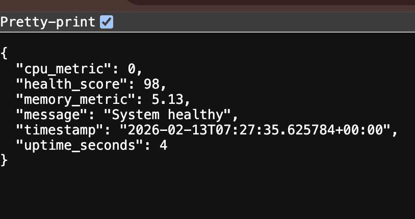

# Cloud Run Monitoring Dashboard 🚀

A lightweight, real-time system monitoring dashboard built with Flask. This application provides key system metrics such as CPU usage, memory consumption, and uptime, visualized in a clean web interface.

## Features ✨

- **Real-time Monitoring**: View live CPU and Memory usage statistics.
- **System Health Check**: Automatic health scoring based on system load.
- **REST API**: JSON endpoint for programmatic access to system metrics.
- **Simple UI**: Clean, responsive interface for quick status checks.

## Dashboard Preview 📸

### System Overview
This view provides a quick snapshot of the system's current status.


### Detailed Analysis
This view shows the detailed metrics and health score calculated by the system.


## Installation 🛠️

1. **Clone the repository:**
   ```bash
   git clone <repository-url>
   cd cloud-run-project-ass-2
   ```

2. **Navigate to the application directory:**
   ```bash
   cd deploy_app
   ```

3. **Create a virtual environment:**
   ```bash
   python3 -m venv venv
   source venv/bin/activate  # On Windows use `venv\Scripts\activate`
   ```

4. **Install dependencies:**
   ```bash
   pip install -r requirements.txt
   ```

## Usage 🚀

1. **Start the application:**
   ```bash
   python main.py
   ```

2. **Access the dashboard:**
   Open your browser and navigate to `http://localhost:8080`.

## API Documentation 📡

### Get System Analysis

Returns current system metrics and health status.

- **URL**: `/analyze`
- **Method**: `GET`
- **Success Response**:
  - **Code**: 200 OK
  - **Content**:
    ```json
    {
      "cpu_metric": 12.5,
      "health_score": 90,
      "memory_metric": 45.2,
      "message": "System healthy",
      "timestamp": "2023-10-27T10:00:00+00:00",
      "uptime_seconds": 3600
    }
    ```

## Project Structure 📂

```
cloud-run-project-ass-2/
├── deploy_app/
│   ├── main.py           # Application entry point
│   ├── requirements.txt  # Python dependencies
│   ├── Dockerfile       # Container configuration
│   └── venv/            # Virtual environment
├── images/               # Documentation assets
└── README.md             # Project documentation
```
